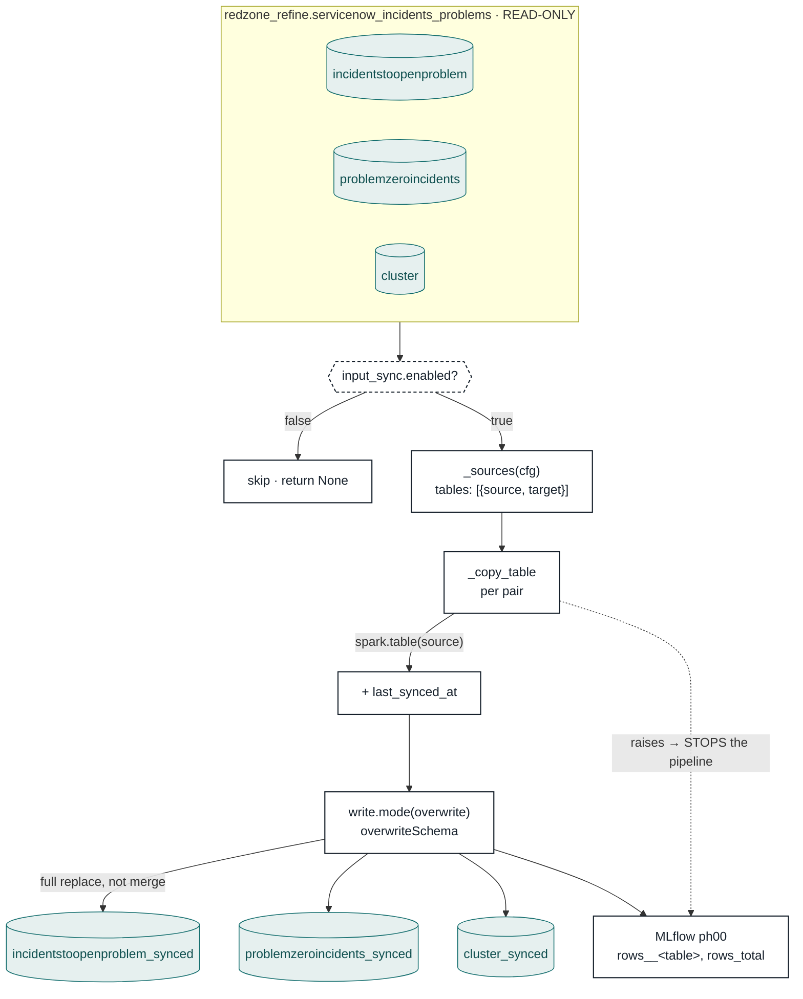

# 00 — Input Sync · flow

Three tables cross one boundary. `refine` belongs to data engineering and is never written
to; the pipeline works only on its own `consume` mirrors, so it can redact them, add columns
and re-run without touching anyone else's table.

## Why there is no delete logic

The engineers drop a **complete** snapshot every run, so the new snapshot is the whole
truth. A closed or removed record disappears by being absent from it. There is no
add/update/delete path to get wrong — and nothing to reconcile when one goes stale.

## Why a failure here stops everything

`_copy_table` lets its exception propagate. A half-written mirror would still be readable
by stage 01, which would score it, and every stage after that would report success on
partial data. Failing loudly at the front is the only place that is cheap to notice.

## The gap worth knowing

There is **no empty-snapshot guard**. If an empty or truncated snapshot lands in `refine`,
stage 00 will overwrite good mirrors with it and every downstream stage runs on nothing.
Recovery is Delta time-travel (`VERSION AS OF`). A minimum-row-count check would be cheap
insurance before this reaches prod.

See [`README.md`](README.md) for config and MLflow keys.

PNG export (1920px-wide, for slides): [`diagram.png`](diagram.png).
