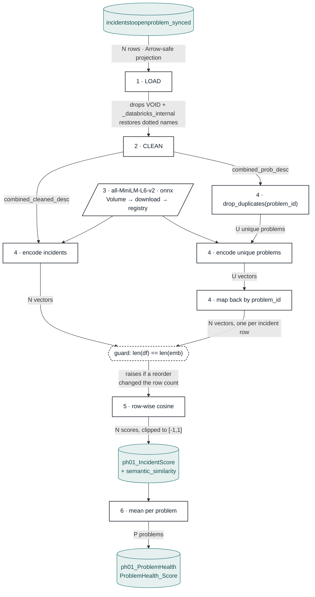

# 01 — Problem Health · flow

The stage encodes two populations and then compares them row by row. Incidents are encoded
one-for-one; problems are **deduplicated first**, encoded once each, then mapped back out to
every incident that references them. That map-back is the only reason the two arrays line up.

`N` = incidents, `U` = distinct problems, `P` = problems with at least one incident.
Problems are encoded `U` times, not `N` — the same problem text is reused across every
incident linked to it.

## Why the dedup is safe

Encoding runs on `U` unique problems, but the map-back reattaches a vector to every one of
the `N` incident rows. No incident is dropped — the output keeps the full incident grain,
and only the encode cost shrinks.

## Why the guard exists

Embeddings are paired to rows **by position**, and that link lives nowhere but in memory. A
reorder between encoding and scoring keeps the array shape identical, so the cosine still
computes — it just scores every row against the wrong problem. The row-count check in
`similarity.add_similarity` is what turns that silent corruption into a crash.

See [`README.md`](README.md) for the stage's modules, outputs and MLflow keys.

PNG export (1920px-wide, for slides): [`diagram.png`](diagram.png).
