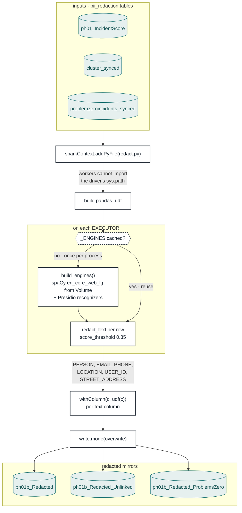

# 01b — PII Redaction · flow

The gate. Stage 02 and stage 05 send text off-cluster, so every table either of them can
reach passes through here first. Redaction is **in place and irreversible** — the span is
replaced by an `<ENTITY>` tag, and the mirror is overwritten.

## Why `addPyFile` is in the picture

The `pandas_udf` closes over `redact.py`, and cloudpickle serializes that **by reference** —
the worker does `import redact`, which fails with `ModuleNotFoundError` because the driver's
`sys.path` entry for this stage folder does not propagate to Python workers. Shipping the
file explicitly is what makes the UDF runnable at all.

## Why the engine cache is a module global

`en_core_web_lg` costs seconds and hundreds of megabytes to load. Building it per row — or
even per batch — would dominate the stage. It is built once per executor **process** and
stashed on the module, so every later batch on that worker reuses it.

## The threshold trap

`score_threshold` **must stay below 0.4**. Presidio scores `PHONE_NUMBER` at exactly 0.4, so
a threshold of 0.5 still redacts names and emails — the output looks correct — while
silently leaking every phone number. Pinned by `tests/test_pii_redaction.py`.

A text column listed in config but absent from the table only **warns**; if *none* of the
listed columns exist the stage raises, because that means the config points at the wrong
table and nothing would be redacted at all.

See [`README.md`](README.md) for entities, recognizers and MLflow keys.
