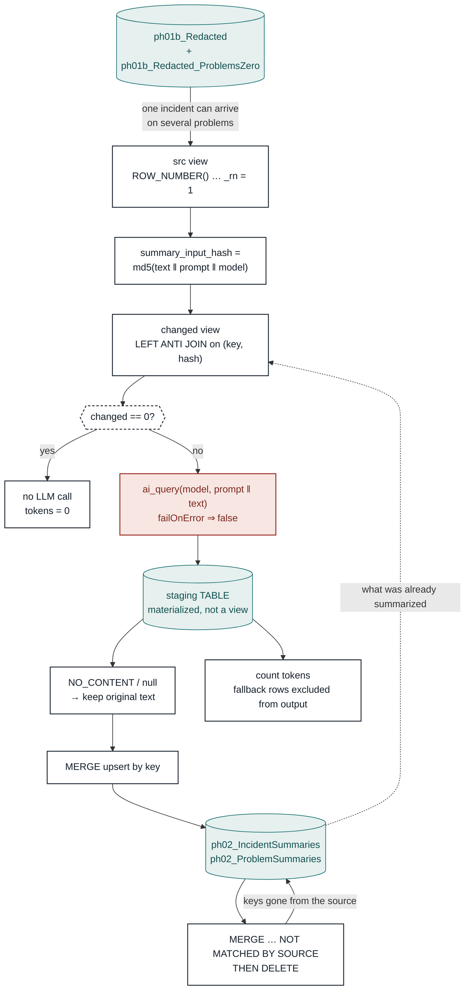

# 02 — LLM Summarization · flow

The stage is mostly a cache. The LLM call is one node in the middle; everything around it
exists so a row is sent **once** and never re-billed unless its text, the prompt, or the
model actually changed.

## Why the hash includes the prompt and the model

Text alone is not enough. Edit a prompt or swap the model and the old summaries are stale,
but their text is unchanged — a text-only key would keep serving them forever. Folding both
into the key means an edit re-summarizes exactly the rows it affects, and nothing else.

The flip side is the cost of a prompt change: **every** row's hash moves, so the whole
corpus is re-billed. That is the price tag on adding an acronym glossary.

## Why `_rn = 1` comes before anything else

The source key is `(number, problem_id)`, so an incident linked to three problems arrives
three times. Without the dedup the LLM is billed three times for identical text, and the
`MERGE` fails outright with `DELTA_MULTIPLE_SOURCE_ROW_MATCHING_TARGET_ROW`.

## Why the results are written to a table, not a view

A lazy view over `ai_query()` re-executes on every action. Counting fallbacks and then
merging would run — and bill — the model twice. Materializing to a staging table forces
exactly one execution.

## Two egress points, one summarizer

Stage 05's gap-fill calls this same `summarize_entity` on the unlinked tickets, writing to
its own table. Its spend lands on the `ph05` run as `gapfill_*`, so a run's true LLM cost is
`ph02_tokens_total` + `ph05_gapfill_tokens_total`.

See [`README.md`](README.md) for token accounting and MLflow keys.
