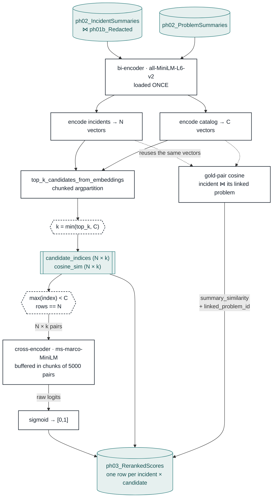

# 03 — Cross-encoder Rerank · flow

Two models in series, for a reason. Scoring every incident against every problem with a
cross-encoder is `N × catalog` forward passes; the bi-encoder cuts that to `N × 50` by
shortlisting first, and only then does the expensive model run.

`N` = linked incidents, `C` = problems in the catalog, `k` = candidates kept per incident
(`top_k: 50`, clamped down when the catalog is smaller).

## Why the shortlist never builds the full matrix

`N × C` cosines would materialize a matrix the size of the whole cross product. The
shortlist walks incidents in chunks, computes one chunk against the catalog, takes its
top-`k` with `argpartition`, and drops the rest before the next chunk.

## Why `top_k` clamping is drawn

If the catalog holds fewer problems than `top_k`, the shortlist returns that many instead —
37 problems with `top_k: 50` gives 37 candidates per incident. Every count in the logs and
in MLflow is taken from the **actual** shortlist width, so `pairs_reranked` reflects work
really done rather than work requested.

## Why the gold-pair cosine is free here

Stage 01 scores each incident against its already-linked problem on raw text. The same pair
scored on **summaries** is one dot product against embeddings this stage already has in
memory — no extra encode, no LLM call. `linked_problem_id` rides along because the grain is
`(number, linked problem)`, not incident: an incident linked to two problems produces two
rows with two different scores, and stage 04 needs the id to publish the right one.

See [`README.md`](README.md) for the output schema and MLflow keys.

PNG export (1920px-wide, for slides): [`diagram.png`](diagram.png).
