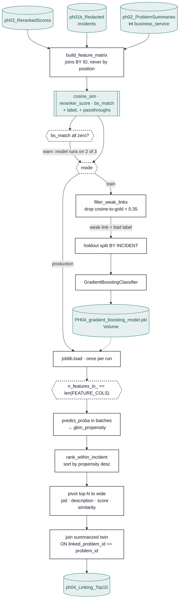

# 04 — Gradient Boosting · flow

One stage, two modes off the same feature builder. Production scores and publishes the
sheet; `mode: train` fits a new model and writes no linking table. They share
`build_feature_matrix` on purpose — a separate training path is how train/serve skew starts.

## Why the weak-link filter is train-only

`min_semantic_similarity` drops incidents whose cosine to their **gold** problem is weak —
a bad link is a bad label. In production the gold problem is the thing being predicted, so
filtering on it would leak the answer and skip exactly the incidents that most need linking.
It is kept out structurally: `similarity_col` is a passthrough that is deliberately **not**
in `FEATURE_COLS`, so `inference.score` reads `feature_df[FEATURE_COLS]` and can never see
it.

## Why two guards sit on the model

`bs_match` fails **silently**: if `business_service` is missing on either side the feature
is 0 for every row and the model quietly runs on two of its three inputs, with every
downstream number still looking plausible. And sklearn only checks feature *count*, not
names or order — a model fitted on a different column set scores garbage without raising.
Both are turned into loud output.

## Why the twin joins on `linked_problem_id`

`summary_similarity` is `(number, linked problem)` grain. An incident linked to two problems
has two of them, and picking one by row order put one problem's summarized score beside
another problem's raw score — a lift the summarizer never gave. The join is on the gold id
the sheet actually publishes. Pinned by `tests/test_linking.py`.

See [`README.md`](README.md) for the sheet's column reference.

PNG export (1920px-wide, for slides): [`diagram.png`](diagram.png).
