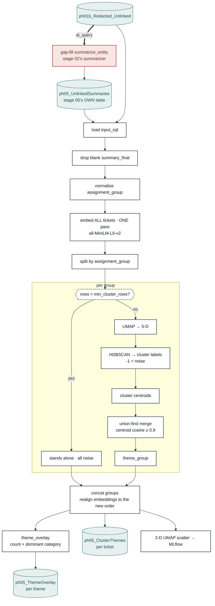

# 05 — Clustering · flow

The other half of the pipeline: tickets with **no** problem record. There is nothing to
recommend against, so instead they are grouped into themes. Embedding happens once
globally; clustering happens per assignment group.

## Why embedding is outside the group loop

Every ticket gets one vector regardless of which group it lands in. Encoding per group would
re-batch — and on a cold cache reload the model — once per group, for identical vectors.
Clustering is what varies per group, so only that is in the loop.

## Why the ids are not globally unique

`cluster` and `theme_group` restart at 0 inside each group. The real key is
`(assignment_group, theme_group, cluster)`. Reading `theme_group = 3` without its group is
meaningless.

## Why the embeddings are realigned after the loop

Groups are concatenated back in group order, not original row order. The 2-D plot colours
each point by its vector, so skipping the realignment would paint every point with another
ticket's embedding — a plot that looks fine and means nothing.

## Why the gap-fill writes its own table

Sharing `ph02_output_IncidentSummaries` let stage 02's `drop_deleted` wipe these rows every
run, re-billing the LLM for every unlinked ticket. Its spend is logged separately as
`gapfill_*` on the `ph05` run.

## What cannot be validated yet

`cluster_synced` currently holds ~10 tickets in one assignment group. Below
`min_cluster_rows` every group takes the stand-alone path — all noise, no merges, empty
overlay. The group-loop branches are covered by synthetic tests; re-check the knobs when
real volume lands.

See [`README.md`](README.md) for how to read the output tables.

PNG export (1920px-wide, for slides): [`diagram.png`](diagram.png).
