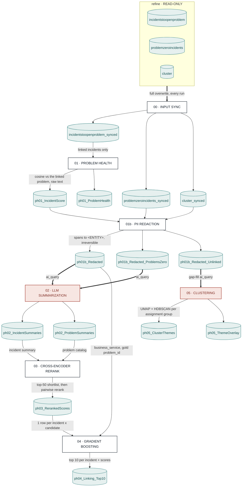

# ProblemHealth Pipeline

End-to-end incident → problem intelligence pipeline. One entry point (`run.py`)
runs six stages in sequence (00 input sync, then 01–05), each reading the previous
stage's Delta output. All stages share `config.yml` and log into a single MLflow
run (keys are stage-namespaced: `ph01_*`, `ph03_top_5_accuracy`, …).

Run everything with `run.main()`; run one stage with `run.stage00()` … `run.stage05()`.

---

## Top-level flow

One snapshot in, two answers out: ranked problem recommendations for incidents that are
already linked, and clustered themes for the ones that are not. Both branches cross the
same LLM boundary.



Every stage writes a live Delta table and the next stage reads it — nothing is passed in
memory, so any stage can be re-run alone.

**Two LLM egress points, not one.** Stage 02 and stage 05's gap-fill both call `ai_query`.
Any table either one reads must appear in `pii_redaction.tables`, or unredacted text leaves
the cluster. The same split applies to cost: a run's true spend is `ph02_tokens_total` plus
`ph05_gapfill_tokens_total`.

**Gating.** `run.main()` opens one MLflow run wrapping every stage. Stage 00 runs first and
**raises on failure**, stopping everything — a bad mirror poisons all five stages behind it.
Stage 02 runs only if 01 produced output; 03 only if 02 did; 04 only if 03 did. Stage 05
runs regardless of 03/04.

PNG export of this diagram: [`Pipeline.png`](Pipeline.png).

Per-stage diagrams live next to each stage's doc, e.g.
[`01-problem-health/diagram.md`](01-problem-health/diagram.md).

---

## Stage 00 — Input Sync (`run_input_sync`)

Full-snapshot MERGE of the prod `refine` incident snapshot into a `consume` mirror
the pipeline reads. Refine is never mutated. One MERGE covers INSERT (new ticket),
UPDATE (content changed), and DELETE (row absent from snapshot → problem closed).
"Closed" is inferred by ABSENCE, so this is correct ONLY on FULL snapshots —
`input_sync.hard_delete=false` for incremental feeds. Gated by `input_sync.enabled`.

```
  refine full snapshot (input_sync.source)
        │
        ▼
  stamp row_hash = md5(hash_columns) + last_synced_at
        │
        ├── target absent?  ──yes──► overwrite-create mirror ──► RETURN count
        │ no
        ▼
  MERGE INTO consume mirror ON key_columns:
     • matched + hash changed   → UPDATE   (re-summarize downstream)
     • matched + hash equal     → no-op
     • not matched by target    → INSERT
     • not matched by source    → DELETE   (only if hard_delete, FULL snapshot)
        │
        ▼
  input_sync.target  (consume mirror the pipeline reads)
```

---

## Stage 01 — Problem Health (`run_problem_health`, 8 steps)

Semantic similarity between each incident and its candidate problem. Incremental:
only new/changed incidents are re-scored; unchanged rows are reused, deletions
propagate.

```
 [1/8] Load input          table  OR  ServiceNow REST gateway
          │                 (source.type = "table" | "servicenow")
 [2/8] Incremental          identify_changes(new vs existing) + find_deleted_keys
          │                        │
          │                  ┌─────┴──────┐
          │            nothing to     rows to
          │            score          score
          │              │              │
          │              │              ▼
 [3/8] Clean text        │      clean_text_step
 [4/8] Embed             │      load model → encode incident + (dedup) problem emb
 [5/8] Similarity        │      add cosine(incident, problem)
 [6/8] Merge             │      new scores ⊕ unchanged rows
          │              │              │
          ▼              ▼              ▼
 [7/8] Save incidents ──────────►  ph01_output_IncidentScore_SemanticSimilarity
 [8/8] Aggregate problem health ─►  ph01_output_ProblemHealth
          │
          ▼
      MLflow: incidents_scored, problems_scored, deleted, per-step timings,
              input data-quality (dup-key %, null-text %)
```

---

## Stage 02 — LLM Summarization (`run_summarization`)

Generates concise summaries for incidents and problems, reusing an LLM. Hash-keyed
MERGE: already-summarized rows are reused (no re-billing), only the gap is sent.

```
  ph01_output_IncidentScore_SemanticSimilarity
        │
        ▼
  summarize_entity(problem)  ──► ph02_output_ProblemSummaries
  summarize_entity(incident) ──► ph02_output_IncidentSummaries
        │                              │
        │                     (hash MERGE → reuse unchanged, summarize only new)
        ▼
  optional: save_to_volume (parquet)
        │
        ▼
  MLflow: model, input_table, changed/total counts
```

---

## Stage 03 — Cross-Encoder Rerank (`run_reranking`)

For each incident, take the top-K candidate problems by cosine, then rerank those
pairs with a cross-encoder (more accurate, more expensive → only on the shortlist).

```
  incidents (ph01 / sql)          ph02_output_ProblemSummaries (problem catalog)
        │                                 │
        └──────────────┬──────────────────┘
                       ▼
        _candidate_indices  → top_k problems per incident (by cosine)
                       │      (guards: row-count + max-index alignment checks)
                       ▼
        load_cross_encoder → rerank(incident × candidate pairs)
                       │      chunked + batched
                       ▼
        to_probabilities (sigmoid)
                       │
                       ▼
        ph03_output_RerankedScores   (+ optional .npy to volume)
                       │
                       ▼
        MLflow: pair count, top_k, model
        reuse_existing: skip entirely if outputs already present
```

---

## Stage 04 — Gradient Boost Inference (`run_gbm_inference`)

Combines cosine + reranker signals into a feature matrix, scores with a trained
GBM, ranks candidates per incident, and emits the top-10 linking table.

```
  ph03 reranked ──┐
  ph01 incidents ─┼──►  build_feature_matrix (cosine, reranker, business-service match, …)
  ph02 summaries ─┘            │
                               ▼
                     load GBM model → score
                               │
                               ▼
                     rank_candidates per incident
                               │
                               ▼
                       build_top10_linking
                       (top_n = 10 problems
                        per incident)
                               │
                               ▼
                    ph04_output_Incident_Problem_Linking_Top10

     (topk_match_rate — k = 1,5,7,10 — runs in TRAIN mode only: production
      incidents have no gold problem_id to score against)
                                    (+ optional volume)
        reuse_existing: skip if output table already present
```

---

## Stage 05 — Clustering / Theme Grouping (`run_clustering`)

Embeds ticket summaries ONCE, then reduces / clusters / merges **inside each
assignment group** (`group_col`). Cluster and theme ids restart per group, so the
key is `(assignment_group, theme_group, cluster)`. **Two edge-case guards, now per
group:**

1. **Too few rows** (`< min_cluster_rows`, default 15, floored at `n_neighbors + 1`)
   → group stands alone: no clustering, no merging, all noise.
2. **`< 2` clusters** (all noise, or a single cluster) → skip the merge step.

```
  [gap-fill] ensure every ticket has a ph02 summary (hash MERGE, reuse)
        │
        ▼
  load frame (ph02 summaries ⋈ ph01 incidents) → drop blank text
        │
        ▼
  normalize group key (str, trimmed, blank/NaN → "Unknown") → _split_groups
        │
        ▼
  cl.embed(summary_final)  ← ONE pass over every ticket ──►  embeddings
        │
        ▼
  ╔══════════════ FOR EACH assignment_group (embeddings sliced) ══════════════╗
  ║                                                                           ║
  ║  ┌──────────── EDGE CASE 1 — len(group) < min_cluster_rows ? ──────────┐  ║
  ║  │  YES → small_sample_noise()        NO → reduce_umap → 5-D          │  ║
  ║  │        all labels = -1                  cluster_hdbscan → labels   │  ║
  ║  │        status = small_group_...         cluster_stats → n_clusters,│  ║
  ║  │        (UMAP would also error)              n_noise, noise_pct, sil│  ║
  ║  └─────────────────────────────────────────────────────────────────────┘  ║
  ║        │  df["cluster"] = labels ; df["cluster_status"] = status           ║
  ║        ▼                                                                  ║
  ║  ┌──────────── EDGE CASE 2 — n_clusters < 2 ? (mg.resolve_themes) ─────┐  ║
  ║  │  YES → SKIP merge                  NO → cluster_centroids          │  ║
  ║  │        theme = cluster (noise -1)       merge_clusters (cosine≥thr,│  ║
  ║  │        merge_log = []                       union-find) → merge_log│  ║
  ║  └─────────────────────────────────────────────────────────────────────┘  ║
  ║        │  df["theme_group"] = cluster.map(theme_map)                       ║
  ╚═══════════════════════════════════════════════════════════════════════════╝
        │  concat groups → one frame (embeddings realigned to it)
        ▼
  ov.theme_overlay per group (category breakdown per group × theme)
        │
        ▼
  _log_plot → MLflow 2-D scatter, coloured "<group> #<theme>" (best-effort)
        │
        ▼
  _save_tables → ph05_output_ClusterThemes + ph05_output_ThemeOverlay (overwrite)
        │
        ▼
  MLflow: n_groups, groups_clustered/too_small, total_clusters, total_themes,
          n_noise, noise_pct + silhouette (row-weighted), n_merges
          + per_group_stats.json  (rollups logged in BOTH branches → a skipped
          group shows as groups_too_small, not as a gap)
```

---

## Data lineage (tables)

| Stage | Reads | Writes |
|-------|-------|--------|
| 00 | `input_sync.source` (refine full snapshot) | `input_sync.target` (consume mirror) |
| 01 | `tables.input` (consume mirror, or ServiceNow) | `ph01_output_IncidentScore_SemanticSimilarity`, `ph01_output_ProblemHealth` |
| 02 | `ph01_output_IncidentScore_SemanticSimilarity` | `ph02_output_IncidentSummaries`, `ph02_output_ProblemSummaries` |
| 03 | ph01 incidents + `ph02_output_ProblemSummaries` | `ph03_output_RerankedScores` |
| 04 | `ph03_output_RerankedScores` + ph01 incidents + `ph02_output_ProblemSummaries` | `ph04_output_Incident_Problem_Linking_Top10` |
| 05 | ph01 incidents + `ph02_output_IncidentSummaries` (gap-filled) | `ph05_output_ClusterThemes`, `ph05_output_ThemeOverlay` |

See `PARAMETERS.md` for the tunable knobs per stage.
