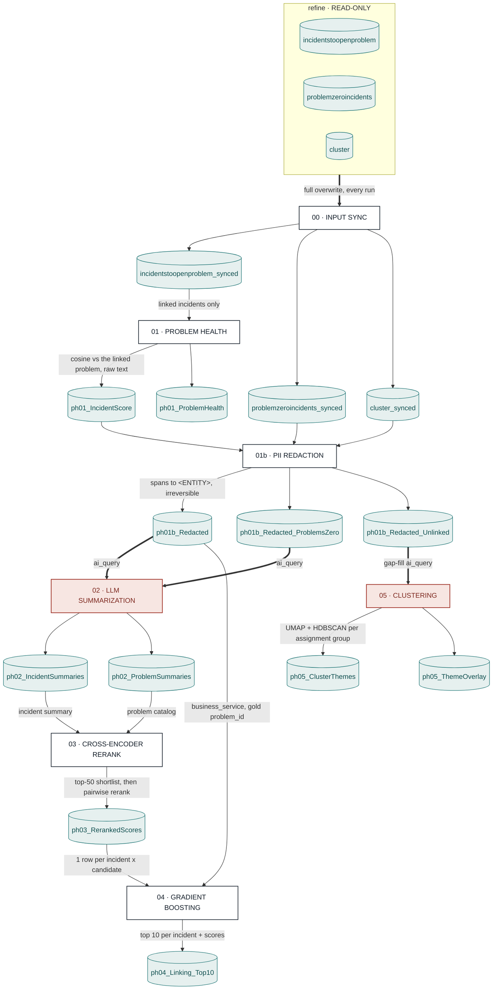

# ProblemHealth Pipeline

End-to-end incident → problem intelligence pipeline. One entry point (`run.py`)
runs six stages in sequence (00 input sync, then 01–05), each reading the previous
stage's Delta output. All stages share `config.yml` and log into a single MLflow
run (keys are stage-namespaced: `ph01_*`, `ph03_top_5_accuracy`, …).

Run everything with `run.main()`; run one stage with `run.stage00()` … `run.stage05()`.

---

## Top-level flow

One snapshot in, two answers out: ranked problem recommendations for incidents that are
already linked, and clustered themes for the ones that are not. Both branches cross the
same LLM boundary.

Every stage writes a live Delta table and the next stage reads it — nothing is passed in
memory, so any stage can be re-run alone.

**Two LLM egress points, not one.** Stage 02 and stage 05's gap-fill both call `ai_query`.
Any table either one reads must appear in `pii_redaction.tables`, or unredacted text leaves
the cluster. The same split applies to cost: a run's true spend is `ph02_tokens_total` plus
`ph05_gapfill_tokens_total`.

**Gating.** `run.main()` opens one MLflow run wrapping every stage. Stage 00 runs first and
**raises on failure**, stopping everything — a bad mirror poisons all five stages behind it.
Stage 02 runs only if 01 produced output; 03 only if 02 did; 04 only if 03 did. Stage 05
runs regardless of 03/04.

PNG export of this diagram: [`Pipeline.png`](Pipeline.png).

Per-stage diagrams live next to each stage's doc, e.g.
[`01-problem-health/diagram.md`](01-problem-health/diagram.md).

---

## Per-stage detail

Each stage owns a folder: `README.md` for modules, outputs and MLflow keys, `diagram.md`
for how the stage works inside, and `diagram.png` for slides.

| Stage | Docs |
|---|---|
| 00 Input Sync | [`00-input-sync/`](00-input-sync/README.md) · [diagram](00-input-sync/diagram.md) |
| 01 Problem Health | [`01-problem-health/`](01-problem-health/README.md) · [diagram](01-problem-health/diagram.md) |
| 01b PII Redaction | [`01b-pii-redaction/`](01b-pii-redaction/README.md) · [diagram](01b-pii-redaction/diagram.md) |
| 02 LLM Summarization | [`02-llm-summarization/`](02-llm-summarization/README.md) · [diagram](02-llm-summarization/diagram.md) |
| 03 Cross-encoder Rerank | [`03-cross-encoder-rerank/`](03-cross-encoder-rerank/README.md) · [diagram](03-cross-encoder-rerank/diagram.md) |
| 04 Gradient Boosting | [`04-gradient-boost-inference/`](04-gradient-boost-inference/README.md) · [diagram](04-gradient-boost-inference/diagram.md) |
| 05 Clustering | [`05-clustering/`](05-clustering/README.md) · [diagram](05-clustering/diagram.md) |

This file deliberately does **not** restate each stage. It used to, and those sections
drifted ~140 lines out of date — describing a `row_hash` column and a `hard_delete` flag
stage 00 never wrote, and an incremental stage 01 that has always been a full run.

---

## Data lineage (tables)

All names are relative to `redzone_consume.tcs_servicenow_analytics` unless shown otherwise.

| Stage | Reads | Writes |
|-------|-------|--------|
| 00 | `redzone_refine.servicenow_incidents_problems.{incidentstoopenproblem, problemzeroincidents, cluster}` | `incidentstoopenproblem_synced`, `problemzeroincidents_synced`, `cluster_synced` |
| 01 | `incidentstoopenproblem_synced` (or the ServiceNow REST gateway) | `ph01_output_IncidentScore_SemanticSimilarity`, `ph01_output_ProblemHealth` |
| 01b | `ph01_output_IncidentScore_SemanticSimilarity`, `cluster_synced`, `problemzeroincidents_synced` | `ph01b_output_Redacted`, `ph01b_output_Redacted_Unlinked`, `ph01b_output_Redacted_ProblemsZero` |
| 02 | `ph01b_output_Redacted`, `ph01b_output_Redacted_ProblemsZero` | `ph02_output_IncidentSummaries`, `ph02_output_ProblemSummaries` |
| 03 | `ph02_output_IncidentSummaries` ⋈ `ph01b_output_Redacted`, `ph02_output_ProblemSummaries` | `ph03_output_RerankedScores` |
| 04 | `ph03_output_RerankedScores`, `ph01b_output_Redacted`, `ph02_output_ProblemSummaries` ⋈ `business_service` | `ph04_output_Incident_Problem_Linking_Top10` |
| 05 | `ph01b_output_Redacted_Unlinked` → `ph05_output_UnlinkedSummaries` | `ph05_output_ClusterThemes`, `ph05_output_ThemeOverlay` |

**Only stage 01b reads a raw table** — they are the thing being redacted. Every stage after
it reads a `ph01b_*` mirror, because `linking.py` copies every column of its incidents frame
straight into the published sheet. `tests/test_pii_redaction.py` asserts this for all four
downstream config blocks.

See [`PARAMETERS.md`](PARAMETERS.md) for the tunable knobs per stage.
